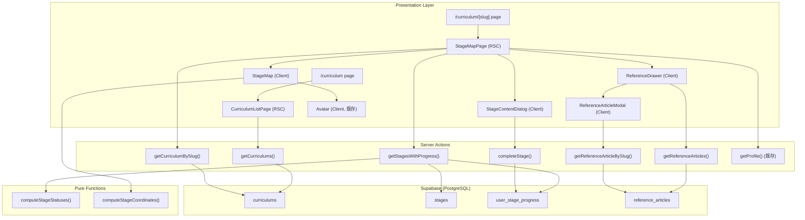
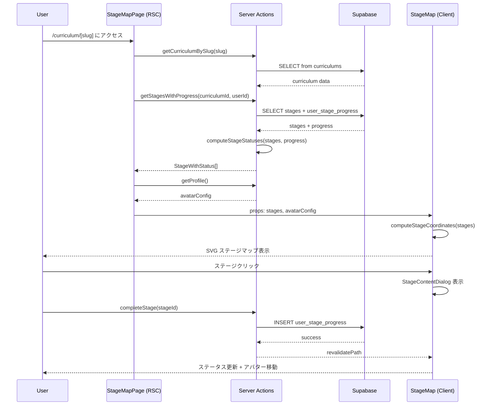
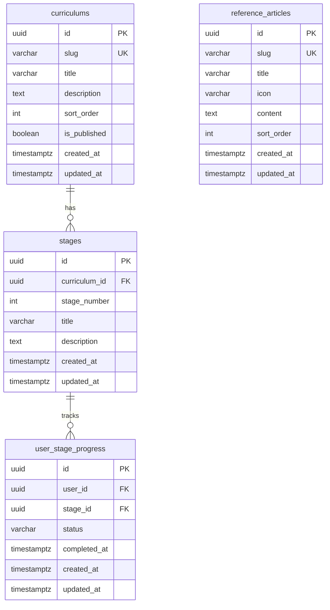

# Design Document: カリキュラム管理機能

## Overview

カリキュラム管理機能は、ユーザーがゲームスタイルのステージマップ上で学習カリキュラムを進行できる機能を提供する。MVP ではフロントエンドカリキュラム（3ステージ）のみを実装する。

### 設計判断

**Supabase クライアント直接利用（Prisma 不使用）**: カリキュラムテーブルは `uuid` PK と `auth.users` FK を使用するため、ULID ベースの既存 Prisma モデルとは異なるスキーマ設計となる。Prisma スキーマに混在させると型の不整合が生じるため、`createClient()` (from `@/lib/supabase/server`) を使ったクエリで直接アクセスする。

**DDD ライト構成**: この機能はシンプルな CRUD + ステータス計算が中心であり、フル DDD（集約・値オブジェクト・リポジトリ）は過剰。Server Actions + 型定義 + 純粋関数によるステータス計算で構成する。ステータス計算ロジックは純粋関数として分離し、テスト可能性を確保する。

**SVG ステージマップ**: Canvas ではなく SVG を採用。理由: DOM ベースでアクセシビリティ属性（aria-label, tabIndex, role）を直接付与可能。foreignObject で既存 Avatar コンポーネントを埋め込み可能。viewBox によるレスポンシブ対応が容易。

## Architecture

### システム構成図



### データフロー



## Components and Interfaces

### ファイル構成

```
app/(public)/curriculum/
├── layout.tsx                    # カリキュラム共通レイアウト（Gear FAB 配置）
├── page.tsx                      # カリキュラム一覧ページ (RSC)
└── [slug]/
    └── page.tsx                  # ステージマップページ (RSC)

src/components/features/curriculum/
├── StageMap.tsx                  # SVG ステージマップ (Client Component)
├── StageContentDialog.tsx        # ステージコンテンツダイアログ (Client)
├── ReferenceDrawer.tsx           # 参考記事ドロワー (Client)
├── ReferenceArticleModal.tsx     # 参考記事モーダル (Client)
└── GearFab.tsx                   # 歯車 FAB ボタン (Client)

src/presentation/actions/curriculum/
├── getCurriculums.ts             # カリキュラム一覧取得
├── getCurriculumBySlug.ts        # カリキュラム詳細取得
├── getStagesWithProgress.ts      # ステージ + 進捗取得 + ステータス計算
├── completeStage.ts              # ステージ完了
├── getReferenceArticles.ts       # 参考記事一覧取得
└── getReferenceArticleBySlug.ts  # 参考記事詳細取得

src/lib/curriculum/
├── types.ts                      # 型定義
├── computeStageStatuses.ts       # ステージステータス計算（純粋関数）
├── computeStageStatuses.test.ts  # テスト
├── computeStageCoordinates.ts    # ステージ座標計算（純粋関数）
└── computeStageCoordinates.test.ts # テスト

scripts/
└── seed-curriculum.sql           # シードデータ SQL
```

### 型定義

```typescript
// src/lib/curriculum/types.ts

export type StageStatus = 'completed' | 'in_progress' | 'unlocked' | 'locked';

export type Curriculum = {
  id: string;
  slug: string;
  title: string;
  description: string;
  sort_order: number;
  is_published: boolean;
  created_at: string;
  updated_at: string;
};

export type Stage = {
  id: string;
  curriculum_id: string;
  stage_number: number;
  title: string;
  description: string;
  created_at: string;
  updated_at: string;
};

export type UserStageProgress = {
  id: string;
  user_id: string;
  stage_id: string;
  status: string;
  completed_at: string | null;
  created_at: string;
  updated_at: string;
};

export type StageWithStatus = Stage & {
  status: StageStatus;
};

export type CurriculumWithProgress = Curriculum & {
  total_stages: number;
  completed_stages: number;
};

export type StageCoordinate = {
  x: number;
  y: number;
  stageNumber: number;
};

export type ReferenceArticle = {
  id: string;
  slug: string;
  title: string;
  icon: string;
  content: string;
  sort_order: number;
  created_at: string;
  updated_at: string;
};
```

### コンポーネントインターフェース

```typescript
// StageMap.tsx
interface StageMapProps {
  stages: StageWithStatus[];
  avatarConfig: AvatarConfig | null;
  onStageClick: (stage: StageWithStatus) => void;
}

// StageContentDialog.tsx
interface StageContentDialogProps {
  stage: StageWithStatus | null;
  open: boolean;
  onOpenChange: (open: boolean) => void;
  onComplete: (stageId: string) => Promise<void>;
}

// ReferenceDrawer.tsx
interface ReferenceDrawerProps {
  articles: ReferenceArticle[];
}

// ReferenceArticleModal.tsx
interface ReferenceArticleModalProps {
  article: ReferenceArticle | null;
  open: boolean;
  onOpenChange: (open: boolean) => void;
}

// GearFab.tsx
// props なし（内部で ReferenceDrawer を管理）
```

### 純粋関数インターフェース

```typescript
// computeStageStatuses.ts
export function computeStageStatuses(
  stages: Stage[],
  progressRecords: UserStageProgress[]
): StageWithStatus[];

// computeStageCoordinates.ts
export function computeStageCoordinates(
  stageCount: number,
  svgWidth: number,
  svgHeight: number
): StageCoordinate[];
```

### Server Actions インターフェース

```typescript
// getCurriculums.ts
export async function getCurriculums(): Promise<CurriculumWithProgress[]>;

// getCurriculumBySlug.ts
export async function getCurriculumBySlug(slug: string): Promise<Curriculum | null>;

// getStagesWithProgress.ts
export async function getStagesWithProgress(
  curriculumId: string
): Promise<StageWithStatus[]>;

// completeStage.ts
export async function completeStage(stageId: string): Promise<{ success: boolean; error?: string }>;

// getReferenceArticles.ts
export async function getReferenceArticles(): Promise<ReferenceArticle[]>;

// getReferenceArticleBySlug.ts
export async function getReferenceArticleBySlug(slug: string): Promise<ReferenceArticle | null>;
```


## Data Models

### データベーススキーマ

4テーブルすべて Supabase クライアント経由でアクセスする。Prisma スキーマには追加しない。

#### ER 図



#### DDL

```sql
-- curriculums テーブル
CREATE TABLE IF NOT EXISTS public.curriculums (
  id uuid PRIMARY KEY DEFAULT gen_random_uuid(),
  slug varchar(100) NOT NULL UNIQUE,
  title varchar(200) NOT NULL,
  description text NOT NULL DEFAULT '',
  sort_order int NOT NULL DEFAULT 0,
  is_published boolean NOT NULL DEFAULT false,
  created_at timestamptz NOT NULL DEFAULT now(),
  updated_at timestamptz NOT NULL DEFAULT now()
);

-- stages テーブル
CREATE TABLE IF NOT EXISTS public.stages (
  id uuid PRIMARY KEY DEFAULT gen_random_uuid(),
  curriculum_id uuid NOT NULL REFERENCES public.curriculums(id) ON DELETE CASCADE,
  stage_number int NOT NULL,
  title varchar(200) NOT NULL,
  description text NOT NULL DEFAULT '',
  created_at timestamptz NOT NULL DEFAULT now(),
  updated_at timestamptz NOT NULL DEFAULT now(),
  UNIQUE(curriculum_id, stage_number)
);

CREATE INDEX idx_stages_curriculum_id ON public.stages(curriculum_id);

-- user_stage_progress テーブル
CREATE TABLE IF NOT EXISTS public.user_stage_progress (
  id uuid PRIMARY KEY DEFAULT gen_random_uuid(),
  user_id uuid NOT NULL REFERENCES auth.users(id) ON DELETE CASCADE,
  stage_id uuid NOT NULL REFERENCES public.stages(id) ON DELETE CASCADE,
  status varchar(20) NOT NULL DEFAULT 'completed',
  completed_at timestamptz,
  created_at timestamptz NOT NULL DEFAULT now(),
  updated_at timestamptz NOT NULL DEFAULT now(),
  UNIQUE(user_id, stage_id)
);

CREATE INDEX idx_user_stage_progress_user_id ON public.user_stage_progress(user_id);
CREATE INDEX idx_user_stage_progress_stage_id ON public.user_stage_progress(stage_id);

-- reference_articles テーブル
CREATE TABLE IF NOT EXISTS public.reference_articles (
  id uuid PRIMARY KEY DEFAULT gen_random_uuid(),
  slug varchar(100) NOT NULL UNIQUE,
  title varchar(200) NOT NULL,
  icon varchar(10) NOT NULL DEFAULT '📄',
  content text NOT NULL DEFAULT '',
  sort_order int NOT NULL DEFAULT 0,
  created_at timestamptz NOT NULL DEFAULT now(),
  updated_at timestamptz NOT NULL DEFAULT now()
);

-- RLS ポリシー
ALTER TABLE public.curriculums ENABLE ROW LEVEL SECURITY;
ALTER TABLE public.stages ENABLE ROW LEVEL SECURITY;
ALTER TABLE public.user_stage_progress ENABLE ROW LEVEL SECURITY;
ALTER TABLE public.reference_articles ENABLE ROW LEVEL SECURITY;

-- curriculums: 認証ユーザーは公開カリキュラムを読み取り可能
CREATE POLICY "Authenticated users can read published curriculums"
  ON public.curriculums FOR SELECT
  TO authenticated
  USING (is_published = true);

-- stages: 認証ユーザーは読み取り可能
CREATE POLICY "Authenticated users can read stages"
  ON public.stages FOR SELECT
  TO authenticated
  USING (true);

-- user_stage_progress: 自分の進捗のみ読み書き可能
CREATE POLICY "Users can read own progress"
  ON public.user_stage_progress FOR SELECT
  TO authenticated
  USING (user_id = auth.uid());

CREATE POLICY "Users can insert own progress"
  ON public.user_stage_progress FOR INSERT
  TO authenticated
  WITH CHECK (user_id = auth.uid());

CREATE POLICY "Users can update own progress"
  ON public.user_stage_progress FOR UPDATE
  TO authenticated
  USING (user_id = auth.uid());

-- reference_articles: 認証ユーザーは読み取り可能
CREATE POLICY "Authenticated users can read reference articles"
  ON public.reference_articles FOR SELECT
  TO authenticated
  USING (true);
```

### ステージステータス計算ロジック

`computeStageStatuses` は純粋関数として実装する。テスト容易性が高く、Server Action から呼び出す。

```typescript
// src/lib/curriculum/computeStageStatuses.ts
export function computeStageStatuses(
  stages: Stage[],
  progressRecords: UserStageProgress[]
): StageWithStatus[] {
  // 1. stage_number 昇順でソート
  const sorted = [...stages].sort((a, b) => a.stage_number - b.stage_number);

  // 2. progress を stage_id でインデックス化
  const progressMap = new Map(
    progressRecords.map(p => [p.stage_id, p])
  );

  // 3. 各ステージのステータスを計算
  return sorted.map((stage, index) => {
    const progress = progressMap.get(stage.id);

    if (progress?.status === 'completed') {
      return { ...stage, status: 'completed' as const };
    }

    if (index === 0) {
      // 最初のステージは常に unlocked
      return { ...stage, status: 'unlocked' as const };
    }

    // 前のステージが completed なら unlocked、そうでなければ locked
    const prevStage = sorted[index - 1]!;
    const prevProgress = progressMap.get(prevStage.id);

    if (prevProgress?.status === 'completed') {
      return { ...stage, status: 'unlocked' as const };
    }

    return { ...stage, status: 'locked' as const };
  });
}
```

### ステージ座標計算ロジック

`computeStageCoordinates` は純粋関数として実装する。ステージを蛇行パスで配置する。

```typescript
// src/lib/curriculum/computeStageCoordinates.ts
export function computeStageCoordinates(
  stageCount: number,
  svgWidth: number,
  svgHeight: number
): StageCoordinate[] {
  if (stageCount === 0) return [];

  const padding = 80;
  const usableWidth = svgWidth - padding * 2;
  const usableHeight = svgHeight - padding * 2;

  // 蛇行パス: 奇数行は左→右、偶数行は右→左
  const cols = 3;
  const rows = Math.ceil(stageCount / cols);
  const rowHeight = rows > 1 ? usableHeight / (rows - 1) : 0;

  return Array.from({ length: stageCount }, (_, i) => {
    const row = Math.floor(i / cols);
    const colInRow = i % cols;
    const isEvenRow = row % 2 === 0;

    const colPosition = isEvenRow ? colInRow : (cols - 1 - colInRow);
    const x = padding + (cols > 1 ? (colPosition / (cols - 1)) * usableWidth : usableWidth / 2);
    const y = padding + row * rowHeight;

    return { x, y, stageNumber: i + 1 };
  });
}
```

### SVG ステージマップ描画

StageMap コンポーネントは以下の構造で SVG を描画する:

```
<svg viewBox="0 0 600 400">
  <!-- 接続線 -->
  <line x1={coord[0].x} y1={coord[0].y} x2={coord[1].x} y2={coord[1].y} />
  ...

  <!-- ステージ円 -->
  <g role="button" tabIndex={0} aria-label="ステージ1: HTML基礎 - 完了">
    <circle cx={x} cy={y} r={30} fill={statusColor} />
    <text x={x} y={y}>{stageNumber}</text>
  </g>
  ...

  <!-- アバターインジケーター (Current Stage の上) -->
  <foreignObject x={currentX - 24} y={currentY - 72} width={48} height={48}>
    <Avatar config={avatarConfig} size={48} />
  </foreignObject>
</svg>
```

ステータスごとの色:
- `completed`: 緑 (`oklch(0.65 0.2 145)`)
- `in_progress` / `unlocked`: 青 (`oklch(0.55 0.2 260)` = primary)
- `locked`: グレー (`oklch(0.3 0 0)`)

### Server Action: completeStage

```typescript
// src/presentation/actions/curriculum/completeStage.ts
'use server';

import { createClient } from '@/lib/supabase/server';
import { revalidatePath } from 'next/cache';

export async function completeStage(stageId: string): Promise<{ success: boolean; error?: string }> {
  const supabase = await createClient();
  const { data: { user } } = await supabase.auth.getUser();

  if (!user) {
    return { success: false, error: 'ログインが必要です' };
  }

  const { error } = await supabase
    .from('user_stage_progress')
    .upsert(
      {
        user_id: user.id,
        stage_id: stageId,
        status: 'completed',
        completed_at: new Date().toISOString(),
        updated_at: new Date().toISOString(),
      },
      { onConflict: 'user_id,stage_id' }
    );

  if (error) {
    return { success: false, error: 'ステージの完了に失敗しました' };
  }

  revalidatePath('/curriculum');
  return { success: true };
}
```

### Reference Drawer アーキテクチャ

参考記事ドロワーは `curriculum/layout.tsx` に配置し、すべての `/curriculum/*` ページで利用可能にする。

```
curriculum/layout.tsx
├── {children}           # ページコンテンツ
└── GearFab              # 固定位置 FAB
    └── ReferenceDrawer  # Sheet (left side)
        └── ReferenceArticleModal  # Dialog (記事表示)
```

- GearFab: `fixed bottom-4 left-4` に配置。歯車アイコン (lucide-react の `Settings`)。
- ReferenceDrawer: shadcn/ui の Sheet (`side="left"`) を使用。記事一覧を表示。
- ReferenceArticleModal: shadcn/ui の Dialog を使用。react-markdown で Markdown レンダリング。

### Avatar 統合

既存の `Avatar` コンポーネント (`src/components/features/Avatar.tsx`) を SVG 内で `<foreignObject>` を使って埋め込む。

```tsx
<foreignObject
  x={currentStageX - 24}
  y={currentStageY - 72}
  width={48}
  height={48}
  style={{ overflow: 'visible' }}
>
  <Avatar config={avatarConfig ?? { style: 'avataaars', seed: 'default' }} size={48} />
</foreignObject>
```

`foreignObject` は HTML コンテンツを SVG 内に埋め込む標準的な方法で、DiceBear の `` タグをそのまま利用できる。


## Correctness Properties

*A property is a characteristic or behavior that should hold true across all valid executions of a system — essentially, a formal statement about what the system should do. Properties serve as the bridge between human-readable specifications and machine-verifiable correctness guarantees.*

### Property 1: ステージステータス計算の正確性

*For any* set of stages (sorted or unsorted) and any set of progress records, `computeStageStatuses` SHALL:
- Return stages sorted by `stage_number` ascending
- Assign `completed` status to any stage with a completed progress record
- Assign `unlocked` status to the first stage if it has no completed progress record
- Assign `unlocked` status to any non-first stage whose predecessor is `completed` and itself has no completed progress record
- Assign `locked` status to any non-first stage whose predecessor is not `completed` and itself has no completed progress record

**Validates: Requirements 4.1, 4.2, 4.3, 4.4, 4.5**

### Property 2: 現在のステージ特定

*For any* output of `computeStageStatuses`, the first stage with `unlocked` status (if any) SHALL be the current stage. If all stages are `completed`, there SHALL be no current stage.

**Validates: Requirements 4.6**

### Property 3: ステージ座標の境界内配置

*For any* stage count (1 以上), SVG width, and SVG height, `computeStageCoordinates` SHALL return coordinates where every point is within the SVG bounds (0 ≤ x ≤ width, 0 ≤ y ≤ height), the number of coordinates equals the stage count, and stage numbers are sequential starting from 1.

**Validates: Requirements 3.3**

### Property 4: 進捗表示フォーマット

*For any* non-negative integer `completed_count` and positive integer `total_count` where `completed_count ≤ total_count`, the progress indicator string SHALL equal `"{completed_count}/{total_count} ステージ完了"`.

**Validates: Requirements 2.2**

## Error Handling

| エラー状況 | 対応 |
|---|---|
| 未認証ユーザーが `/curriculum` にアクセス | middleware でリダイレクト or ページ内で `/login` にリダイレクト |
| 存在しない slug でアクセス | `notFound()` を呼び出し 404 ページ表示 |
| `completeStage` 失敗（DB エラー） | `{ success: false, error: string }` を返し、クライアントで toast 表示 |
| `completeStage` 未認証 | `{ success: false, error: 'ログインが必要です' }` を返す |
| ロック済みステージのクリック | クライアント側で `cursor-not-allowed` + クリックイベント無視 |
| プロフィール未設定（avatarConfig が null） | デフォルトシード `{ style: 'avataaars', seed: 'default' }` を使用 |
| Supabase クエリエラー | Server Action で空配列 or null を返し、UI で適切なフォールバック表示 |

## Testing Strategy

### テストアプローチ

この機能は DDD ライト構成のため、テスト対象は以下に集中する:

1. **純粋関数の Property-Based Testing** (fast-check): `computeStageStatuses`, `computeStageCoordinates`
2. **純粋関数の Unit Testing** (vitest): エッジケース、具体例
3. **Server Actions の Integration Testing**: Supabase との結合テスト（将来）
4. **E2E Testing** (Playwright): ユーザーフロー全体（将来）

### Property-Based Testing 設定

- ライブラリ: `fast-check` (既にインストール済み)
- 最小イテレーション: 100 回
- タグフォーマット: `Feature: curriculum-management, Property {number}: {property_text}`

### テストファイル構成

```
src/lib/curriculum/
├── computeStageStatuses.test.ts       # Property + Unit tests
└── computeStageCoordinates.test.ts    # Property + Unit tests
```

### Property Test 実装方針

**Property 1 & 2 (computeStageStatuses)**:
- ジェネレーター: ランダムなステージ数 (1-20)、ランダムな stage_number 順序、ランダムな完了パターン
- アサーション: ソート順、ステータス割り当てルール、現在ステージ特定

**Property 3 (computeStageCoordinates)**:
- ジェネレーター: ランダムなステージ数 (1-20)、ランダムな SVG サイズ (200-1200)
- アサーション: 座標が境界内、座標数がステージ数と一致、stageNumber が連番

**Property 4 (進捗フォーマット)**:
- ジェネレーター: ランダムな completed_count (0-100)、total_count (completed_count-100)
- アサーション: フォーマット文字列が正しい

### Unit Test 方針

- 具体的なシナリオ（3ステージで最初だけ完了、全完了、全未完了）
- エッジケース（ステージ0個、ステージ1個）
- テスト名は日本語で「〜のとき、〜する」形式
- AAA パターン準拠
