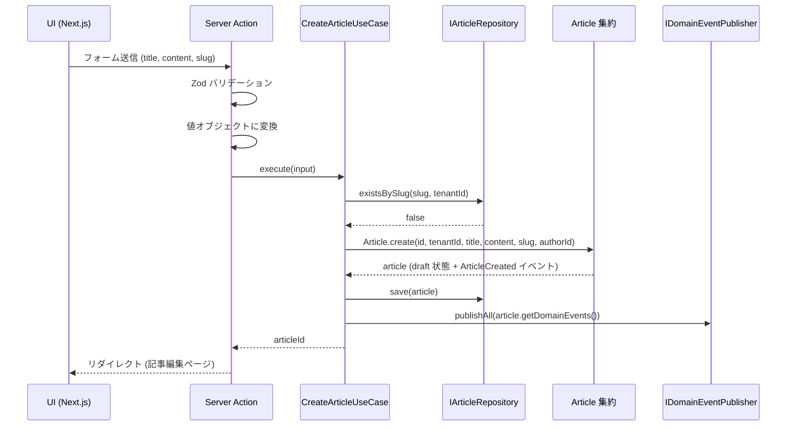
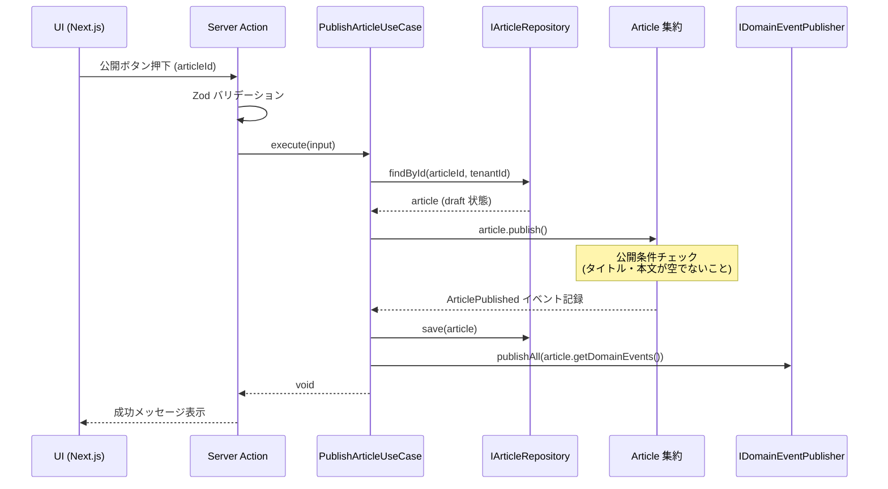
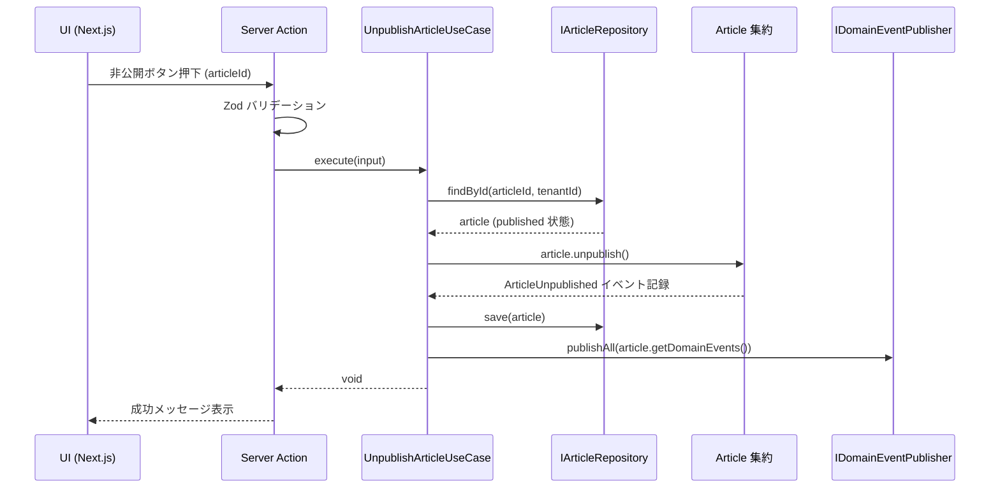
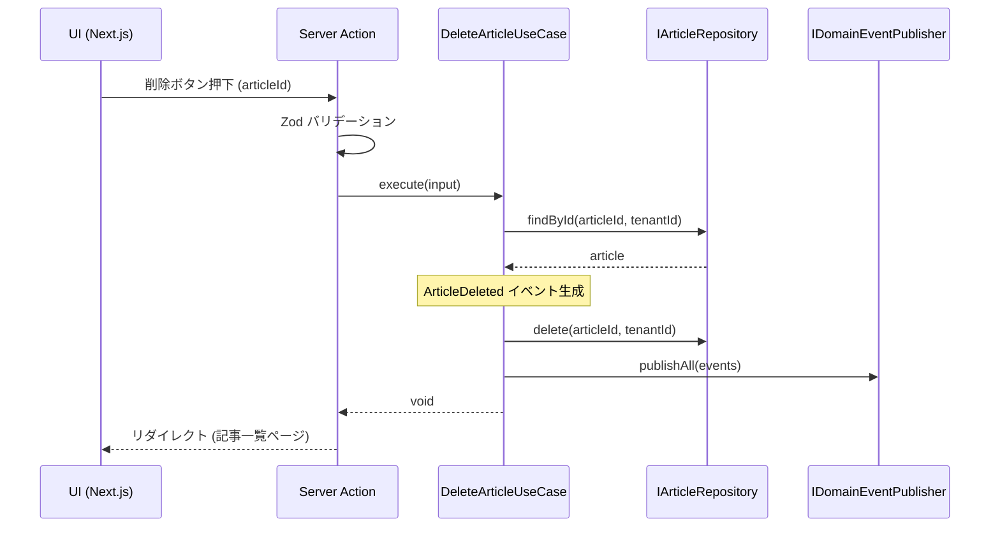
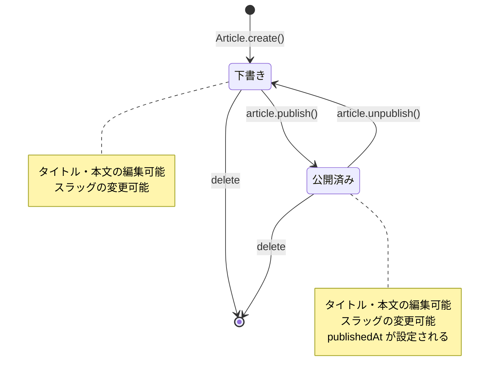

# 設計ドキュメント: Publishing Context — 記事機能

## 概要

Publishing Context における記事 (Article) の執筆・管理・公開機能を設計する。Article を集約ルートとし、記事のライフサイクル全体 (作成 → 編集 → 公開 → 非公開 → 削除) をドメインモデルで表現する。

加えて、記事に対するエンゲージメント機能 (閲覧数カウント、いいね、ブックマーク) を提供する。タグは taxonomy コンテキストと連携し、記事の検索・分類を支援する。記事一覧・ブックマーク一覧にはカーソルベースのページネーションを採用する。

本機能は技術ブログの基盤であり、将来的にはエンタープライズ向けコンテンツプラットフォームへの拡張を見据えている。マルチテナント設計を初期段階から組み込み、すべてのエンティティに `tenantId` を持たせる。コンテキスト間の通信は shared-kernel 経由で行い、identity コンテキストの `UserId` を著者情報として参照する。

## アーキテクチャ

### レイヤー構成

```mermaid
graph TD
    subgraph Presentation["プレゼンテーション層"]
        SA["Server Actions<br/>(Zod バリデーション)"]
        UI["Next.js App Router<br/>(UI コンポーネント)"]
    end

    subgraph Application["アプリケーション層"]
        CUC["CreateArticleUseCase"]
        UUC["UpdateArticleUseCase"]
        PUC["PublishArticleUseCase"]
        UPUC["UnpublishArticleUseCase"]
        DUC["DeleteArticleUseCase"]
        RVC["RecordViewUseCase"]
        TLC["ToggleLikeUseCase"]
        TBC["ToggleBookmarkUseCase"]
        LAC["ListArticlesUseCase"]
        LBC["ListBookmarksUseCase"]
    end

    subgraph Domain["ドメイン層"]
        AGG["Article 集約"]
        ENG["ArticleLike / ArticleBookmark"]
        VO["値オブジェクト<br/>(ArticleId, ArticleTitle,<br/>ArticleContent, ArticleStatus,<br/>Slug, ViewCount, LikeCount)"]
        EVT["ドメインイベント<br/>(ArticleCreated, ArticlePublished,<br/>ArticleUnpublished, ArticleDeleted,<br/>ArticleLiked, ArticleBookmarked)"]
        REPO_IF["IArticleRepository<br/>IArticleLikeRepository<br/>IArticleBookmarkRepository<br/>(インターフェース)"]
    end

    subgraph Infrastructure["インフラ層"]
        REPO_IMPL["PrismaArticleRepository"]
        DB["Supabase (PostgreSQL)"]
    end

    subgraph SharedKernel["shared-kernel"]
        TID["TenantId"]
        UID["UserId"]
        EID["EntityId (基底クラス)"]
    end

    UI --> SA
    SA --> Application
    Application --> Domain
    REPO_IMPL --> REPO_IF
    REPO_IMPL --> DB
    Domain -.-> SharedKernel
end
```

### ディレクトリ構造

```
src/contexts/publishing/
├── domain/
│   ├── article/
│   │   ├── Article.ts              # 集約ルート
│   │   ├── Article.test.ts
│   │   ├── ArticleId.ts            # 値オブジェクト
│   │   ├── ArticleTitle.ts
│   │   ├── ArticleTitle.test.ts
│   │   ├── ArticleContent.ts
│   │   ├── ArticleContent.test.ts
│   │   ├── ArticleStatus.ts
│   │   ├── ArticleStatus.test.ts
│   │   ├── Slug.ts
│   │   ├── Slug.test.ts
│   │   ├── ViewCount.ts
│   │   ├── ViewCount.test.ts
│   │   ├── LikeCount.ts
│   │   ├── LikeCount.test.ts
│   │   ├── ArticleCreated.ts       # ドメインイベント
│   │   ├── ArticlePublished.ts
│   │   ├── ArticleUnpublished.ts
│   │   └── ArticleDeleted.ts
│   ├── like/
│   │   ├── ArticleLike.ts          # いいねエンティティ
│   │   ├── ArticleLike.test.ts
│   │   ├── ArticleLiked.ts         # ドメインイベント
│   │   └── ArticleLikeRemoved.ts
│   ├── bookmark/
│   │   ├── ArticleBookmark.ts      # ブックマークエンティティ
│   │   ├── ArticleBookmark.test.ts
│   │   ├── ArticleBookmarked.ts    # ドメインイベント
│   │   └── ArticleBookmarkRemoved.ts
│   ├── IArticleRepository.ts       # リポジトリインターフェース
│   ├── IArticleLikeRepository.ts
│   └── IArticleBookmarkRepository.ts
├── application/
│   ├── CreateArticleUseCase.ts
│   ├── CreateArticleUseCase.test.ts
│   ├── UpdateArticleUseCase.ts
│   ├── UpdateArticleUseCase.test.ts
│   ├── PublishArticleUseCase.ts
│   ├── PublishArticleUseCase.test.ts
│   ├── UnpublishArticleUseCase.ts
│   ├── UnpublishArticleUseCase.test.ts
│   ├── DeleteArticleUseCase.ts
│   ├── DeleteArticleUseCase.test.ts
│   ├── RecordViewUseCase.ts
│   ├── RecordViewUseCase.test.ts
│   ├── ToggleLikeUseCase.ts
│   ├── ToggleLikeUseCase.test.ts
│   ├── ToggleBookmarkUseCase.ts
│   ├── ToggleBookmarkUseCase.test.ts
│   ├── ListArticlesUseCase.ts
│   ├── ListArticlesUseCase.test.ts
│   ├── ListBookmarksUseCase.ts
│   └── ListBookmarksUseCase.test.ts
└── infrastructure/
    ├── PrismaArticleRepository.ts
    ├── PrismaArticleRepository.integration.test.ts
    ├── PrismaArticleLikeRepository.ts
    ├── PrismaArticleLikeRepository.integration.test.ts
    ├── PrismaArticleBookmarkRepository.ts
    └── PrismaArticleBookmarkRepository.integration.test.ts
```

## コンポーネントとインターフェース

### コンポーネント 1: Article 集約 (集約ルート)

**目的**: 記事のライフサイクル管理とビジネスルールの保護

**インターフェース**:

```typescript
// src/contexts/publishing/domain/article/Article.ts
export class Article {
  private constructor(
    private readonly id: ArticleId,
    private readonly tenantId: TenantId,
    private title: ArticleTitle,
    private content: ArticleContent,
    private status: ArticleStatus,
    private slug: Slug,
    private readonly authorId: UserId,
    private tagIds: TagId[],
    private viewCount: ViewCount,
    private likeCount: LikeCount,
    private publishedAt: Date | null,
    private readonly createdAt: Date,
    private updatedAt: Date,
  ) {}

  // ファクトリメソッド
  static create(
    id: ArticleId,
    tenantId: TenantId,
    title: ArticleTitle,
    content: ArticleContent,
    slug: Slug,
    authorId: UserId,
    tagIds?: TagId[],
  ): Article;

  // 再構築用 (リポジトリからの復元)
  static reconstruct(params: {
    id: ArticleId;
    tenantId: TenantId;
    title: ArticleTitle;
    content: ArticleContent;
    status: ArticleStatus;
    slug: Slug;
    authorId: UserId;
    tagIds: TagId[];
    viewCount: ViewCount;
    likeCount: LikeCount;
    publishedAt: Date | null;
    createdAt: Date;
    updatedAt: Date;
  }): Article;

  // コマンド
  updateTitle(newTitle: ArticleTitle): void;
  updateContent(newContent: ArticleContent): void;
  updateSlug(newSlug: Slug): void;
  updateTags(tagIds: TagId[]): void;
  publish(): void;
  unpublish(): void;
  incrementViewCount(): void;
  incrementLikeCount(): void;
  decrementLikeCount(): void;

  // クエリ
  isDraft(): boolean;
  isPublished(): boolean;
  equals(other: Article): boolean;

  // ドメインイベント
  getDomainEvents(): DomainEvent[];
  clearDomainEvents(): void;
}
```

**責務**:

- 記事の作成時に下書き (draft) 状態で初期化
- タイトル・本文・スラッグ・タグの更新 (更新日時の自動更新)
- 公開条件の検証と状態遷移 (draft → published)
- 非公開への状態遷移 (published → draft)
- 閲覧数・いいね数の非正規化カウンター管理
- ドメインイベントの記録と提供

**タグ連携**:

- `tagIds` は taxonomy コンテキストの `TagId` を shared-kernel 経由で参照
- タグの存在確認はユースケース層で taxonomy コンテキストのリポジトリを使用
- Article 集約はタグ ID のリストのみ保持 (タグ名等は持たない)

### コンポーネント 2: 値オブジェクト群

#### ArticleId

```typescript
// src/contexts/publishing/domain/article/ArticleId.ts
export class ArticleId extends EntityId {
  private constructor(value: string) {
    super(value);
  }

  static generate(): ArticleId;
  static fromString(value: string): ArticleId;
}
```

#### ArticleTitle

```typescript
// src/contexts/publishing/domain/article/ArticleTitle.ts
export class ArticleTitle {
  private constructor(private readonly value: string) {}

  // 制約: 1文字以上100文字以内、前後の空白はトリム
  static fromString(value: string): ArticleTitle;

  equals(other: ArticleTitle): boolean;
  toString(): string;
  isEmpty(): boolean;
}
```

**バリデーションルール**:

- 空文字は不可
- 100文字を超える場合はエラー
- 前後の空白はトリムして保存

#### ArticleContent

```typescript
// src/contexts/publishing/domain/article/ArticleContent.ts
export class ArticleContent {
  private constructor(private readonly value: string) {}

  // 制約: 空文字を許容 (下書き時)、最大文字数は制限なし
  static fromString(value: string): ArticleContent;

  equals(other: ArticleContent): boolean;
  toString(): string;
  isEmpty(): boolean;
  charCount(): number;
}
```

**バリデーションルール**:

- 空文字を許容 (下書き保存時に本文未入力を許可)
- 公開時に空でないことを Article 集約側で検証

#### ArticleStatus

```typescript
// src/contexts/publishing/domain/article/ArticleStatus.ts
export class ArticleStatus {
  private constructor(private readonly value: "draft" | "published") {}

  static draft(): ArticleStatus;
  static published(): ArticleStatus;

  isDraft(): boolean;
  isPublished(): boolean;
  equals(other: ArticleStatus): boolean;
  toString(): string;
}
```

**状態遷移ルール**:

- `draft` → `published`: 公開 (タイトル・本文が空でないこと)
- `published` → `draft`: 非公開化
- `published` → `published`: 不可 (既に公開済みエラー)
- `draft` → `draft`: 不可 (既に下書きエラー)

#### Slug

```typescript
// src/contexts/publishing/domain/article/Slug.ts
export class Slug {
  private constructor(private readonly value: string) {}

  // 制約: 英数字・ハイフンのみ、1-200文字
  static fromString(value: string): Slug;

  equals(other: Slug): boolean;
  toString(): string;
}
```

**バリデーションルール**:

- 英小文字、数字、ハイフンのみ許可 (`/^[a-z0-9]+(?:-[a-z0-9]+)*$/`)
- 1文字以上200文字以内
- 先頭・末尾のハイフンは不可
- 連続ハイフンは不可

#### ViewCount

```typescript
// src/contexts/publishing/domain/article/ViewCount.ts
export class ViewCount {
  private constructor(private readonly value: number) {}

  // 制約: 0以上の整数
  static zero(): ViewCount;
  static fromNumber(value: number): ViewCount;

  increment(): ViewCount;
  equals(other: ViewCount): boolean;
  toNumber(): number;
}
```

**バリデーションルール**:

- 0以上の整数のみ
- 負の値は不可
- `increment()` は新しいインスタンスを返す (不変性)

#### LikeCount

```typescript
// src/contexts/publishing/domain/article/LikeCount.ts
export class LikeCount {
  private constructor(private readonly value: number) {}

  // 制約: 0以上の整数
  static zero(): LikeCount;
  static fromNumber(value: number): LikeCount;

  increment(): LikeCount;
  decrement(): LikeCount;
  equals(other: LikeCount): boolean;
  toNumber(): number;
}
```

**バリデーションルール**:

- 0以上の整数のみ
- 負の値は不可
- `decrement()` は 0 未満にならない (0 で下限クランプ)

### コンポーネント 3: ドメインイベント

```typescript
// src/contexts/publishing/domain/article/ArticleCreated.ts
export class ArticleCreated {
  constructor(
    public readonly articleId: ArticleId,
    public readonly tenantId: TenantId,
    public readonly authorId: UserId,
    public readonly createdAt: Date,
  ) {}
}

// src/contexts/publishing/domain/article/ArticlePublished.ts
export class ArticlePublished {
  constructor(
    public readonly articleId: ArticleId,
    public readonly tenantId: TenantId,
    public readonly publishedAt: Date,
  ) {}
}

// src/contexts/publishing/domain/article/ArticleUnpublished.ts
export class ArticleUnpublished {
  constructor(
    public readonly articleId: ArticleId,
    public readonly tenantId: TenantId,
    public readonly unpublishedAt: Date,
  ) {}
}

// src/contexts/publishing/domain/article/ArticleDeleted.ts
export class ArticleDeleted {
  constructor(
    public readonly articleId: ArticleId,
    public readonly tenantId: TenantId,
    public readonly deletedAt: Date,
  ) {}
}

// src/contexts/publishing/domain/like/ArticleLiked.ts
export class ArticleLiked {
  constructor(
    public readonly articleId: ArticleId,
    public readonly userId: UserId,
    public readonly tenantId: TenantId,
    public readonly likedAt: Date,
  ) {}
}

// src/contexts/publishing/domain/like/ArticleLikeRemoved.ts
export class ArticleLikeRemoved {
  constructor(
    public readonly articleId: ArticleId,
    public readonly userId: UserId,
    public readonly tenantId: TenantId,
    public readonly removedAt: Date,
  ) {}
}

// src/contexts/publishing/domain/bookmark/ArticleBookmarked.ts
export class ArticleBookmarked {
  constructor(
    public readonly articleId: ArticleId,
    public readonly userId: UserId,
    public readonly tenantId: TenantId,
    public readonly bookmarkedAt: Date,
  ) {}
}

// src/contexts/publishing/domain/bookmark/ArticleBookmarkRemoved.ts
export class ArticleBookmarkRemoved {
  constructor(
    public readonly articleId: ArticleId,
    public readonly userId: UserId,
    public readonly tenantId: TenantId,
    public readonly removedAt: Date,
  ) {}
}
```

### コンポーネント 4: ArticleLike エンティティ

**目的**: ユーザーが記事に「いいね」した記録を管理

```typescript
// src/contexts/publishing/domain/like/ArticleLike.ts
export class ArticleLike {
  private constructor(
    private readonly articleId: ArticleId,
    private readonly userId: UserId,
    private readonly tenantId: TenantId,
    private readonly createdAt: Date,
  ) {}

  static create(
    articleId: ArticleId,
    userId: UserId,
    tenantId: TenantId,
  ): ArticleLike;

  static reconstruct(params: {
    articleId: ArticleId;
    userId: UserId;
    tenantId: TenantId;
    createdAt: Date;
  }): ArticleLike;
}
```

**設計判断**: ArticleLike は独立エンティティとして管理。Article 集約には `likeCount` を非正規化カウンターとして保持し、一覧表示時のパフォーマンスを確保する。

### コンポーネント 5: ArticleBookmark エンティティ

**目的**: ユーザーが記事をブックマーク (お気に入り) した記録を管理

```typescript
// src/contexts/publishing/domain/bookmark/ArticleBookmark.ts
export class ArticleBookmark {
  private constructor(
    private readonly articleId: ArticleId,
    private readonly userId: UserId,
    private readonly tenantId: TenantId,
    private readonly createdAt: Date,
  ) {}

  static create(
    articleId: ArticleId,
    userId: UserId,
    tenantId: TenantId,
  ): ArticleBookmark;

  static reconstruct(params: {
    articleId: ArticleId;
    userId: UserId;
    tenantId: TenantId;
    createdAt: Date;
  }): ArticleBookmark;
}
```

**設計判断**: マイページのブックマーク一覧で使用。ユーザー × 記事の組み合わせで一意。

### コンポーネント 6: ページネーション

**方式**: カーソルベースページネーション

**理由**:

- オフセットベースは大量データで性能劣化 (OFFSET が大きいほど遅い)
- カーソルベースは一定のパフォーマンス
- 無限スクロールとの相性が良い

```typescript
// src/contexts/shared-kernel/Pagination.ts
export interface PaginationParams {
  cursor?: string; // 最後に取得したアイテムの ID (ULID)
  limit: number; // 1ページあたりの取得件数
  direction?: "forward" | "backward"; // ページ送り方向
}

export interface PaginatedResult<T> {
  items: T[];
  nextCursor: string | null; // 次ページのカーソル (null = 最終ページ)
  prevCursor: string | null; // 前ページのカーソル (null = 先頭ページ)
  hasNextPage: boolean;
  hasPrevPage: boolean;
}
```

**1ページあたりの表示件数**:

| 画面              | デフォルト件数 | 最大件数 |
| ----------------- | -------------- | -------- |
| 記事一覧 (公開)   | 20             | 50       |
| 管理画面 記事一覧 | 20             | 100      |
| ブックマーク一覧  | 20             | 50       |

**ソート順**:

| 画面              | デフォルトソート      | 選択可能なソート               |
| ----------------- | --------------------- | ------------------------------ |
| 記事一覧 (公開)   | 公開日時 降順         | 公開日時, 閲覧数, いいね数     |
| 管理画面 記事一覧 | 更新日時 降順         | 更新日時, 作成日時, ステータス |
| ブックマーク一覧  | ブックマーク日時 降順 | ブックマーク日時               |

### コンポーネント 7: リポジトリインターフェース

#### IArticleRepository

```typescript
// src/contexts/publishing/domain/IArticleRepository.ts
import {
  PaginationParams,
  PaginatedResult,
} from "@/contexts/shared-kernel/Pagination";

export interface ArticleListFilter {
  status?: ArticleStatus;
  authorId?: UserId;
  tagId?: TagId;
}

export interface ArticleSortOption {
  field: "publishedAt" | "createdAt" | "updatedAt" | "viewCount" | "likeCount";
  direction: "asc" | "desc";
}

export interface IArticleRepository {
  findById(id: ArticleId, tenantId: TenantId): Promise<Article | null>;
  findBySlug(slug: Slug, tenantId: TenantId): Promise<Article | null>;
  findPaginated(
    tenantId: TenantId,
    pagination: PaginationParams,
    filter?: ArticleListFilter,
    sort?: ArticleSortOption,
  ): Promise<PaginatedResult<Article>>;
  save(article: Article): Promise<void>;
  delete(id: ArticleId, tenantId: TenantId): Promise<void>;
  existsBySlug(slug: Slug, tenantId: TenantId): Promise<boolean>;
  incrementViewCount(id: ArticleId, tenantId: TenantId): Promise<void>;
}
```

#### IArticleLikeRepository

```typescript
// src/contexts/publishing/domain/IArticleLikeRepository.ts
export interface IArticleLikeRepository {
  findByArticleAndUser(
    articleId: ArticleId,
    userId: UserId,
    tenantId: TenantId,
  ): Promise<ArticleLike | null>;
  save(like: ArticleLike): Promise<void>;
  delete(
    articleId: ArticleId,
    userId: UserId,
    tenantId: TenantId,
  ): Promise<void>;
  countByArticle(articleId: ArticleId, tenantId: TenantId): Promise<number>;
}
```

#### IArticleBookmarkRepository

```typescript
// src/contexts/publishing/domain/IArticleBookmarkRepository.ts
export interface IArticleBookmarkRepository {
  findByArticleAndUser(
    articleId: ArticleId,
    userId: UserId,
    tenantId: TenantId,
  ): Promise<ArticleBookmark | null>;
  findByUserPaginated(
    userId: UserId,
    tenantId: TenantId,
    pagination: PaginationParams,
  ): Promise<PaginatedResult<ArticleBookmark>>;
  save(bookmark: ArticleBookmark): Promise<void>;
  delete(
    articleId: ArticleId,
    userId: UserId,
    tenantId: TenantId,
  ): Promise<void>;
}
```

### コンポーネント 8: ユースケース

```typescript
// src/contexts/publishing/application/CreateArticleUseCase.ts
export interface CreateArticleInput {
  tenantId: TenantId;
  title: ArticleTitle;
  content: ArticleContent;
  slug: Slug;
  authorId: UserId;
  tagIds?: TagId[];
}

export class CreateArticleUseCase {
  constructor(
    private readonly articleRepository: IArticleRepository,
    private readonly eventPublisher: IDomainEventPublisher,
  ) {}

  async execute(input: CreateArticleInput): Promise<ArticleId>;
}
```

```typescript
// src/contexts/publishing/application/UpdateArticleUseCase.ts
export interface UpdateArticleInput {
  articleId: ArticleId;
  tenantId: TenantId;
  title?: ArticleTitle;
  content?: ArticleContent;
  slug?: Slug;
  tagIds?: TagId[];
}

export class UpdateArticleUseCase {
  constructor(private readonly articleRepository: IArticleRepository) {}

  async execute(input: UpdateArticleInput): Promise<void>;
}
```

```typescript
// src/contexts/publishing/application/PublishArticleUseCase.ts
export interface PublishArticleInput {
  articleId: ArticleId;
  tenantId: TenantId;
}

export class PublishArticleUseCase {
  constructor(
    private readonly articleRepository: IArticleRepository,
    private readonly eventPublisher: IDomainEventPublisher,
  ) {}

  async execute(input: PublishArticleInput): Promise<void>;
}
```

```typescript
// src/contexts/publishing/application/UnpublishArticleUseCase.ts
export interface UnpublishArticleInput {
  articleId: ArticleId;
  tenantId: TenantId;
}

export class UnpublishArticleUseCase {
  constructor(
    private readonly articleRepository: IArticleRepository,
    private readonly eventPublisher: IDomainEventPublisher,
  ) {}

  async execute(input: UnpublishArticleInput): Promise<void>;
}
```

```typescript
// src/contexts/publishing/application/DeleteArticleUseCase.ts
export interface DeleteArticleInput {
  articleId: ArticleId;
  tenantId: TenantId;
}

export class DeleteArticleUseCase {
  constructor(
    private readonly articleRepository: IArticleRepository,
    private readonly eventPublisher: IDomainEventPublisher,
  ) {}

  async execute(input: DeleteArticleInput): Promise<void>;
}
```

```typescript
// src/contexts/publishing/application/RecordViewUseCase.ts
export interface RecordViewInput {
  articleId: ArticleId;
  tenantId: TenantId;
}

export class RecordViewUseCase {
  constructor(private readonly articleRepository: IArticleRepository) {}

  // 閲覧数を +1 する (開くたびにカウント)
  async execute(input: RecordViewInput): Promise<void>;
}
```

```typescript
// src/contexts/publishing/application/ToggleLikeUseCase.ts
export interface ToggleLikeInput {
  articleId: ArticleId;
  userId: UserId;
  tenantId: TenantId;
}

export class ToggleLikeUseCase {
  constructor(
    private readonly articleRepository: IArticleRepository,
    private readonly likeRepository: IArticleLikeRepository,
    private readonly eventPublisher: IDomainEventPublisher,
  ) {}

  // いいね済み → 解除、未いいね → いいね (トグル)
  async execute(input: ToggleLikeInput): Promise<{ liked: boolean }>;
}
```

```typescript
// src/contexts/publishing/application/ToggleBookmarkUseCase.ts
export interface ToggleBookmarkInput {
  articleId: ArticleId;
  userId: UserId;
  tenantId: TenantId;
}

export class ToggleBookmarkUseCase {
  constructor(
    private readonly bookmarkRepository: IArticleBookmarkRepository,
    private readonly eventPublisher: IDomainEventPublisher,
  ) {}

  // ブックマーク済み → 解除、未ブックマーク → 追加 (トグル)
  async execute(input: ToggleBookmarkInput): Promise<{ bookmarked: boolean }>;
}
```

```typescript
// src/contexts/publishing/application/ListArticlesUseCase.ts
export interface ListArticlesInput {
  tenantId: TenantId;
  pagination: PaginationParams;
  filter?: ArticleListFilter;
  sort?: ArticleSortOption;
}

export class ListArticlesUseCase {
  constructor(private readonly articleRepository: IArticleRepository) {}

  async execute(input: ListArticlesInput): Promise<PaginatedResult<Article>>;
}
```

```typescript
// src/contexts/publishing/application/ListBookmarksUseCase.ts
export interface ListBookmarksInput {
  userId: UserId;
  tenantId: TenantId;
  pagination: PaginationParams;
}

export class ListBookmarksUseCase {
  constructor(
    private readonly bookmarkRepository: IArticleBookmarkRepository,
    private readonly articleRepository: IArticleRepository,
  ) {}

  // ブックマーク一覧 + 記事情報を返す (マイページ用)
  async execute(input: ListBookmarksInput): Promise<PaginatedResult<Article>>;
}
```

## シーケンス図

### 記事作成フロー



### 記事公開フロー



### 記事非公開フロー



### 記事削除フロー



## データモデル

### Prisma スキーマ

```prisma
// prisma/schema.prisma

model Article {
  id          String    @id @db.Char(26)
  tenantId    String    @map("tenant_id") @db.Char(26)
  title       String    @db.VarChar(100)
  content     String    @db.Text
  status      String    @default("draft") @db.VarChar(20)
  slug        String    @db.VarChar(200)
  authorId    String    @map("author_id") @db.Char(26)
  viewCount   Int       @default(0) @map("view_count")
  likeCount   Int       @default(0) @map("like_count")
  publishedAt DateTime? @map("published_at") @db.Timestamptz()
  createdAt   DateTime  @default(now()) @map("created_at") @db.Timestamptz()
  updatedAt   DateTime  @updatedAt @map("updated_at") @db.Timestamptz()

  tags      ArticleTag[]
  likes     ArticleLike[]
  bookmarks ArticleBookmark[]

  @@unique([tenantId, slug])
  @@index([tenantId])
  @@index([tenantId, status])
  @@index([tenantId, authorId])
  @@index([tenantId, status, publishedAt])
  @@index([tenantId, status, viewCount])
  @@index([tenantId, status, likeCount])
  @@map("articles")
}

model ArticleTag {
  articleId String @map("article_id") @db.Char(26)
  tagId     String @map("tag_id") @db.Char(26)
  tenantId  String @map("tenant_id") @db.Char(26)
  createdAt DateTime @default(now()) @map("created_at") @db.Timestamptz()

  article Article @relation(fields: [articleId], references: [id], onDelete: Cascade)

  @@id([articleId, tagId])
  @@index([tenantId, tagId])
  @@map("article_tags")
}

model ArticleLike {
  articleId String   @map("article_id") @db.Char(26)
  userId    String   @map("user_id") @db.Char(26)
  tenantId  String   @map("tenant_id") @db.Char(26)
  createdAt DateTime @default(now()) @map("created_at") @db.Timestamptz()

  article Article @relation(fields: [articleId], references: [id], onDelete: Cascade)

  @@id([articleId, userId])
  @@index([tenantId, articleId])
  @@map("article_likes")
}

model ArticleBookmark {
  articleId String   @map("article_id") @db.Char(26)
  userId    String   @map("user_id") @db.Char(26)
  tenantId  String   @map("tenant_id") @db.Char(26)
  createdAt DateTime @default(now()) @map("created_at") @db.Timestamptz()

  article Article @relation(fields: [articleId], references: [id], onDelete: Cascade)

  @@id([articleId, userId])
  @@index([tenantId, userId, createdAt])
  @@map("article_bookmarks")
}
```

**設計判断**:

| カラム        | 型             | 理由                          |
| ------------- | -------------- | ----------------------------- |
| `id`          | `Char(26)`     | ULID は固定26文字             |
| `tenantId`    | `Char(26)`     | マルチテナント分離キー        |
| `title`       | `VarChar(100)` | ドメインルールと一致          |
| `content`     | `Text`         | 記事本文は長文を許容          |
| `status`      | `VarChar(20)`  | `draft` / `published`         |
| `slug`        | `VarChar(200)` | URL パス用、テナント内で一意  |
| `authorId`    | `Char(26)`     | shared-kernel の UserId       |
| `viewCount`   | `Int`          | 非正規化カウンター (閲覧数)   |
| `likeCount`   | `Int`          | 非正規化カウンター (いいね数) |
| `publishedAt` | `Timestamptz?` | 公開日時 (未公開時は null)    |

**インデックス設計**:

- `@@unique([tenantId, slug])`: テナント内でスラッグの一意性を保証
- `@@index([tenantId])`: テナント単位の記事一覧取得
- `@@index([tenantId, status])`: テナント内のステータス別記事取得
- `@@index([tenantId, authorId])`: テナント内の著者別記事取得
- `@@index([tenantId, status, publishedAt])`: 公開日時順ソート (カーソルページネーション)
- `@@index([tenantId, status, viewCount])`: 閲覧数順ソート
- `@@index([tenantId, status, likeCount])`: いいね数順ソート
- `@@index([tenantId, tagId])` (ArticleTag): タグによる記事フィルタ
- `@@index([tenantId, userId, createdAt])` (ArticleBookmark): ブックマーク一覧 (マイページ)

### ドメインオブジェクト ↔ 永続化のマッピング

```typescript
// src/contexts/publishing/infrastructure/PrismaArticleRepository.ts

// ドメイン → 永続化
private toPersistence(article: Article): PrismaArticleData {
  return {
    id: article.id.toString(),
    tenantId: article.tenantId.toString(),
    title: article.title.toString(),
    content: article.content.toString(),
    status: article.status.toString(),
    slug: article.slug.toString(),
    authorId: article.authorId.toString(),
    viewCount: article.viewCount.toNumber(),
    likeCount: article.likeCount.toNumber(),
    publishedAt: article.publishedAt,
    createdAt: article.createdAt,
    updatedAt: article.updatedAt,
  };
}

// 永続化 → ドメイン
private toDomain(row: PrismaArticleRow): Article {
  return Article.reconstruct({
    id: ArticleId.fromString(row.id),
    tenantId: TenantId.fromString(row.tenantId),
    title: ArticleTitle.fromString(row.title),
    content: ArticleContent.fromString(row.content),
    status: row.status === 'published'
      ? ArticleStatus.published()
      : ArticleStatus.draft(),
    slug: Slug.fromString(row.slug),
    authorId: UserId.fromString(row.authorId),
    tagIds: (row.tags ?? []).map((t: { tagId: string }) => TagId.fromString(t.tagId)),
    viewCount: ViewCount.fromNumber(row.viewCount),
    likeCount: LikeCount.fromNumber(row.likeCount),
    publishedAt: row.publishedAt,
    createdAt: row.createdAt,
    updatedAt: row.updatedAt,
  });
}
```

## エラーハンドリング

### エラーシナリオ 1: 記事が見つからない

**条件**: `findById` で記事が存在しない場合
**レスポンス**: ユースケース層で `ApplicationError("記事が見つかりません")` をスロー
**復旧**: UI でエラーメッセージを表示し、記事一覧へリダイレクト

### エラーシナリオ 2: 公開条件未達

**条件**: タイトルまたは本文が空の状態で `publish()` を呼び出した場合
**レスポンス**: ドメイン層で `DomainError("公開条件を満たしていません")` をスロー
**復旧**: UI でエラーメッセージを表示し、記事編集画面に留まる

### エラーシナリオ 3: 既に公開済み

**条件**: 公開済み記事に対して `publish()` を呼び出した場合
**レスポンス**: ドメイン層で `DomainError("既に公開済みです")` をスロー
**復旧**: UI でエラーメッセージを表示

### エラーシナリオ 4: 既に下書き状態

**条件**: 下書き記事に対して `unpublish()` を呼び出した場合
**レスポンス**: ドメイン層で `DomainError("既に下書き状態です")` をスロー
**復旧**: UI でエラーメッセージを表示

### エラーシナリオ 5: スラッグ重複

**条件**: 同一テナント内で既に使用されているスラッグで記事を作成・更新した場合
**レスポンス**: ユースケース層で `ApplicationError("このスラッグは既に使用されています")` をスロー
**復旧**: UI でエラーメッセージを表示し、スラッグの変更を促す

## テスト戦略

### 単体テスト方針

**対象**: domain 層 (値オブジェクト、集約)

- 値オブジェクトの必須3テスト: 等価性・不変性・バリデーション
- 集約の必須テスト: 状態遷移・不変条件違反・ドメインイベント発行
- モック禁止 (純粋な TypeScript のみ)
- テスト名は日本語で「〜のとき、〜する」形式
- AAA パターン (Arrange-Act-Assert) に従う

**対象**: application 層 (ユースケース)

- リポジトリをモックして単体テスト
- 正常系・異常系の網羅
- ドメインイベントの発行確認

### プロパティベーステスト方針

**ライブラリ**: fast-check (Vitest と統合)

**対象プロパティ**:

- ArticleTitle: 任意の1-100文字の文字列で作成可能
- Slug: 有効なスラッグパターンで作成可能
- ArticleStatus: 状態遷移の整合性 (draft → published → draft のサイクル)

### 統合テスト方針

**対象**: infrastructure 層 (PrismaArticleRepository)

- 実 DB (テスト用 Supabase) を使用
- CRUD 操作の検証
- テナント分離の検証
- スラッグ一意制約の検証

## セキュリティ考慮事項

- すべてのリポジトリクエリに `tenantId` フィルタを含める (テナント分離)
- RLS を防御の最終ラインとして設定 (Supabase)
- Server Action で認証状態を検証してからユースケースを実行
- スラッグに使用可能な文字を制限し、パストラバーサルを防止

## 依存関係

| 依存先                      | 用途                                         | レイヤー                    |
| --------------------------- | -------------------------------------------- | --------------------------- |
| `shared-kernel/TenantId`    | マルチテナント識別                           | domain                      |
| `shared-kernel/UserId`      | 著者情報・いいね・ブックマークのユーザー参照 | domain                      |
| `shared-kernel/TagId`       | タグ参照 (taxonomy コンテキスト連携)         | domain                      |
| `shared-kernel/EntityId`    | ID 基底クラス                                | domain                      |
| `shared-kernel/DomainEvent` | イベント基底型                               | domain                      |
| `shared-kernel/DomainError` | ドメインエラー基底クラス                     | domain                      |
| `shared-kernel/Pagination`  | ページネーション型定義                       | domain / application        |
| `Prisma`                    | ORM                                          | infrastructure              |
| `Zod`                       | 入力バリデーション                           | presentation                |
| `ulid`                      | ID 生成                                      | shared-kernel (EntityId 内) |

## 状態遷移図



## Correctness Properties

_プロパティとは、システムのすべての有効な実行において成り立つべき特性や振る舞いのことである。プロパティは、人間が読める仕様と機械的に検証可能な正しさの保証を橋渡しする役割を果たす。_

### Property 1: 記事作成の不変条件

_For any_ 有効な ArticleTitle、ArticleContent、Slug、UserId の組み合わせにおいて、Article.create() で生成された記事は、ステータスが draft であり、viewCount が 0、likeCount が 0、publishedAt が null であり、ArticleCreated ドメインイベントが記録されていること

**Validates: Requirements 1.1, 1.3, 14.1**

### Property 2: タグ関連付けの置換

_For any_ TagId のリストにおいて、記事のタグを更新した場合、記事が保持するタグ ID のリストは指定されたリストと完全に一致すること

**Validates: Requirements 1.4, 2.5**

### Property 3: 記事フィールド更新時の updatedAt 更新

_For any_ 有効な ArticleTitle または ArticleContent において、記事のタイトルまたは本文を更新した場合、updatedAt が更新前より新しい値に設定されること

**Validates: Requirements 2.1, 2.2**

### Property 4: 公開状態遷移の正当性

_For any_ タイトルと本文が空でない下書き状態の記事において、publish() を実行した場合、ステータスが published に変更され、publishedAt が設定され、ArticlePublished ドメインイベントが記録されること

**Validates: Requirements 3.1, 14.2**

### Property 5: 不正な状態遷移の拒否

_For any_ 公開済みの記事に対して publish() を実行した場合、エラーがスローされること。また、_For any_ 下書き状態の記事に対して unpublish() を実行した場合、エラーがスローされること

**Validates: Requirements 3.4, 4.2**

### Property 6: 非公開化状態遷移の正当性

_For any_ 公開済みの記事において、unpublish() を実行した場合、ステータスが draft に変更され、ArticleUnpublished ドメインイベントが記録されること

**Validates: Requirements 4.1, 14.3**

### Property 7: ViewCount の不変条件

_For any_ 0以上の整数 n において、ViewCount.fromNumber(n) は有効な ViewCount を返すこと。_For any_ 負の整数において、ViewCount の作成はエラーとなること。_For any_ 有効な ViewCount において、increment() は元の値 +1 の新しいインスタンスを返し、元のインスタンスは変更されないこと

**Validates: Requirements 6.1, 6.2, 6.3, 11.7**

### Property 8: LikeCount の不変条件

_For any_ 0以上の整数 n において、LikeCount.fromNumber(n) は有効な LikeCount を返すこと。_For any_ 負の整数において、LikeCount の作成はエラーとなること。_For any_ 有効な LikeCount において、decrement() の結果は 0 以上であること (0 で下限クランプ)

**Validates: Requirements 7.3, 11.8**

### Property 9: いいねトグルの対称性

_For any_ 記事とユーザーの組み合わせにおいて、いいね未実行状態からトグルすると ArticleLike が作成され likeCount が 1 増加すること。さらにもう一度トグルすると ArticleLike が削除され likeCount が元の値に戻ること

**Validates: Requirements 7.1, 7.2, 14.5, 14.6**

### Property 10: ブックマークトグルの対称性

_For any_ 記事とユーザーの組み合わせにおいて、ブックマーク未実行状態からトグルすると ArticleBookmark が作成されること。さらにもう一度トグルすると ArticleBookmark が削除されること

**Validates: Requirements 8.1, 8.2, 14.7, 14.8**

### Property 11: ページネーション結果の整合性

_For any_ 記事の集合とページネーションパラメータにおいて、返される items の件数は limit 以下であること。hasNextPage が true の場合 nextCursor が null でないこと。hasNextPage が false の場合 nextCursor が null であること。フィルタが指定された場合、返されるすべての記事がフィルタ条件に一致すること

**Validates: Requirements 9.1, 9.5, 9.6**

### Property 12: ソート順の保証

_For any_ 記事の集合とソートオプション (publishedAt, viewCount, likeCount) において、返される記事リストは指定されたフィールドの指定された方向で正しくソートされていること

**Validates: Requirements 9.3, 10.3**

### Property 13: ArticleTitle のバリデーション

_For any_ 1〜100文字の文字列において、ArticleTitle.fromString() は有効な ArticleTitle を返すこと。_For any_ 100文字を超える文字列において、作成はエラーとなること。_For any_ 前後に空白を含む有効な文字列において、保存される値は前後の空白がトリムされていること

**Validates: Requirements 11.1, 11.2, 11.3**

### Property 14: Slug のバリデーション

_For any_ 英小文字・数字・ハイフンのみで構成され、先頭・末尾がハイフンでなく、連続ハイフンを含まない 1〜200文字の文字列において、Slug.fromString() は有効な Slug を返すこと。_For any_ これらの条件を満たさない文字列において、作成はエラーとなること

**Validates: Requirements 11.4, 11.5, 11.6**

### Property 15: ArticleId の ULID バリデーション

_For any_ 有効な ULID 文字列 (26文字、Crockford Base32) において、ArticleId.fromString() は有効な ArticleId を返すこと。_For any_ ULID フォーマットに一致しない文字列において、作成はエラーとなること

**Validates: Requirement 11.9**

### Property 16: ドメインイベントのクリア

_For any_ ドメインイベントが記録された Article において、clearDomainEvents() を実行した場合、getDomainEvents() は空のリストを返すこと

**Validates: Requirement 14.9**
