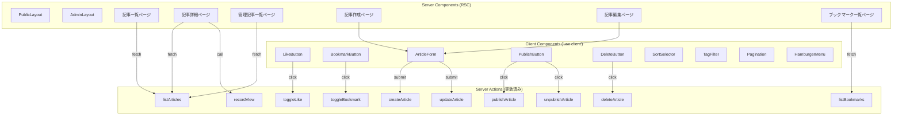

# 設計ドキュメント: Publishing UI — 記事公開プラットフォームのフロントエンド

## 概要

Publishing Context のバックエンド (Server Actions, ユースケース, ドメインモデル) は実装済みである。本設計では、Next.js 15+ App Router 上にフロントエンド UI を構築する。

公開ページ (記事一覧・タグフィルタ・記事詳細) と管理ページ (記事管理一覧・作成・編集・公開/非公開/削除) を提供し、共通コンポーネント (ArticleCard, Pagination, LikeButton, BookmarkButton, ArticleForm) およびレイアウト (PublicLayout, AdminLayout) を構築する。

データフローは Server Components を中心に設計し、インタラクティブな操作 (いいね・ブックマーク・フォーム送信・削除確認) のみ Client Components を使用する。shadcn/ui をベースコンポーネントとして活用し、Tailwind CSS v4 でモバイルファーストのレスポンシブデザインを実現する。

## アーキテクチャ

### データフロー概要



```

### Server Components vs Client Components の判断基準

| 判断基準 | Server Component | Client Component |
|---------|-----------------|-----------------|
| データ取得 (Server Action 呼び出し) | ✅ | - |
| 静的表示 (レイアウト, ヘッダー, フッター) | ✅ | - |
| ユーザーインタラクション (クリック, 入力) | - | ✅ |
| useState / useEffect が必要 | - | ✅ |
| フォーム送信 (useActionState) | - | ✅ |
| URL クエリパラメータの読み取り | ✅ (searchParams) | - |

### ページ別 SC/CC 分類

| ページ/コンポーネント | 種別 | 理由 |
|---------------------|------|------|
| PublicLayout | SC | 静的レイアウト、認証状態の取得 |
| AdminLayout | SC | 静的レイアウト、認証チェック |
| Header | SC | ナビゲーション表示、認証状態の取得 |
| MobileNav | CC | ハンバーガーメニューの開閉状態管理 |
| AdminSidebar | SC | ナビゲーション表示 |
| AdminMobileSidebar | CC | ドロワーの開閉状態管理 |
| 記事一覧ページ | SC | listArticles の呼び出し |
| 記事詳細ページ | SC | findBySlug の呼び出し |
| 管理記事一覧ページ | SC | listArticles の呼び出し |
| 記事作成ページ | SC | ArticleForm のラッパー |
| 記事編集ページ | SC | 既存データ取得 + ArticleForm |
| ブックマーク一覧ページ | SC | listBookmarks の呼び出し |
| ArticleCard | SC | 静的表示 |
| Pagination | CC | クエリパラメータ更新 |
| SortSelector | CC | ソート選択のインタラクション |
| TagFilter | CC | タグ選択のインタラクション |
| LikeButton | CC | toggleLike の呼び出し、楽観的更新 |
| BookmarkButton | CC | toggleBookmark の呼び出し、楽観的更新 |
| ArticleForm | CC | フォーム入力、バリデーション、送信 |
| PublishButton | CC | publishArticle/unpublishArticle の呼び出し |
| DeleteButton | CC | 確認ダイアログ、deleteArticle の呼び出し |

## コンポーネントとインターフェース

### ルーティング構造

```

app/
├── layout.tsx # RootLayout (html, body)
├── globals.css
├── (public)/
│ ├── layout.tsx # PublicLayout (Header + Footer)
│ ├── page.tsx # トップページ (記事一覧へリダイレクト or ランディング)
│ ├── articles/
│ │ ├── page.tsx # 公開記事一覧ページ
│ │ └── [slug]/
│ │ └── page.tsx # 記事詳細ページ
│ └── bookmarks/
│ └── page.tsx # ブックマーク一覧ページ
├── (admin)/
│ ├── layout.tsx # AdminLayout (Header + AdminSidebar)
│ └── articles/
│ ├── page.tsx # 管理記事一覧ページ
│ ├── new/
│ │ └── page.tsx # 記事作成ページ
│ └── [id]/
│ └── edit/
│ └── page.tsx # 記事編集ページ

````

### コンポーネントツリー

```mermaid
graph TD
    RL["RootLayout<br/>(app/layout.tsx)"]

    subgraph Public["(public) グループ"]
        PL["PublicLayout<br/>(SC)"]
        H["Header (SC)"]
        MN["MobileNav (CC)"]
        F["Footer (SC)"]

        ALP["記事一覧ページ (SC)"]
        SS["SortSelector (CC)"]
        TF["TagFilter (CC)"]
        AC["ArticleCard (SC)"]
        PG["Pagination (CC)"]

        ADP["記事詳細ページ (SC)"]
        LB["LikeButton (CC)"]
        BB["BookmarkButton (CC)"]

        BKP["ブックマーク一覧ページ (SC)"]
    end

    subgraph Admin["(admin) グループ"]
        AL["AdminLayout (SC)"]
        AH["Header (SC)"]
        AS["AdminSidebar (SC)"]
        AMS["AdminMobileSidebar (CC)"]

        AMP["管理記事一覧ページ (SC)"]
        PB["PublishButton (CC)"]
        DB["DeleteButton (CC)"]

        ANP["記事作成ページ (SC)"]
        AEP["記事編集ページ (SC)"]
        AFM["ArticleForm (CC)"]
    end

    RL --> PL
    RL --> AL

    PL --> H
    H --> MN
    PL --> F
    PL --> ALP
    PL --> ADP
    PL --> BKP

    ALP --> SS
    ALP --> TF
    ALP --> AC
    ALP --> PG

    ADP --> LB
    ADP --> BB

    BKP --> AC
    BKP --> PG

    AL --> AH
    AL --> AS
    AS --> AMS
    AL --> AMP
    AL --> ANP
    AL --> AEP

    AMP --> PB
    AMP --> DB
    AMP --> PG

    ANP --> AFM
    AEP --> AFM
````

### コンポーネント配置

```
src/components/
├── features/
│   ├── ArticleCard.tsx          # 記事カードコンポーネント
│   ├── ArticleForm.tsx          # 記事作成/編集フォーム
│   ├── LikeButton.tsx           # いいねボタン
│   ├── BookmarkButton.tsx       # ブックマークボタン
│   ├── Pagination.tsx           # ページネーション
│   ├── SortSelector.tsx         # ソート選択
│   ├── TagFilter.tsx            # タグフィルタ
│   ├── PublishButton.tsx        # 公開/非公開ボタン
│   ├── DeleteButton.tsx         # 削除ボタン (確認ダイアログ付き)
│   ├── Header.tsx               # 共通ヘッダー
│   ├── MobileNav.tsx            # モバイルナビゲーション
│   ├── Footer.tsx               # フッター
│   ├── AdminSidebar.tsx         # 管理サイドバー
│   └── AdminMobileSidebar.tsx   # 管理モバイルサイドバー
└── ui/                          # shadcn/ui コンポーネント
    ├── button.tsx
    ├── input.tsx
    ├── textarea.tsx
    ├── label.tsx
    ├── badge.tsx
    ├── card.tsx
    ├── select.tsx
    ├── table.tsx
    ├── dialog.tsx
    ├── sheet.tsx
    ├── toast.tsx (sonner)
    └── tabs.tsx
```

### コンポーネントインターフェース (Props)

#### Header

```typescript
// src/components/features/Header.tsx (Server Component)
// Props なし — 内部で Supabase Auth からユーザー情報を取得
// 認証状態に応じてナビゲーションリンクを出し分け
```

#### MobileNav

```typescript
// src/components/features/MobileNav.tsx ('use client')
interface MobileNavProps {
  isAuthenticated: boolean;
}
```

#### Footer

```typescript
// src/components/features/Footer.tsx (Server Component)
// Props なし — コピーライト表記のみ
```

#### AdminSidebar

```typescript
// src/components/features/AdminSidebar.tsx (Server Component)
// Props なし — 内部で usePathname 相当のロジックでアクティブ状態を判定
// pathname は Server Component では headers() から取得
```

#### AdminMobileSidebar

```typescript
// src/components/features/AdminMobileSidebar.tsx ('use client')
// Props なし — Sheet コンポーネントでドロワー表示
```

#### ArticleCard

```typescript
// src/components/features/ArticleCard.tsx (Server Component)
interface ArticleCardProps {
  article: {
    id: string;
    title: string;
    slug: string;
    publishedAt: string | null;
    viewCount: number;
    likeCount: number;
  };
  className?: string;
}
```

#### Pagination

```typescript
// src/components/features/Pagination.tsx ('use client')
interface PaginationProps {
  nextCursor: string | null;
  prevCursor: string | null;
  hasNextPage: boolean;
  hasPrevPage: boolean;
}
```

#### SortSelector

```typescript
// src/components/features/SortSelector.tsx ('use client')
interface SortSelectorProps {
  currentSort?: string; // 'publishedAt' | 'viewCount' | 'likeCount'
  currentDirection?: string; // 'asc' | 'desc'
}
```

#### TagFilter

```typescript
// src/components/features/TagFilter.tsx ('use client')
interface TagFilterProps {
  currentTagId?: string;
  // タグ一覧は将来 taxonomy コンテキストから取得
}
```

#### LikeButton

```typescript
// src/components/features/LikeButton.tsx ('use client')
interface LikeButtonProps {
  articleId: string;
  initialLikeCount: number;
  initialLiked: boolean;
}
```

#### BookmarkButton

```typescript
// src/components/features/BookmarkButton.tsx ('use client')
interface BookmarkButtonProps {
  articleId: string;
  initialBookmarked: boolean;
}
```

#### ArticleForm

```typescript
// src/components/features/ArticleForm.tsx ('use client')
interface ArticleFormProps {
  mode: 'create' | 'edit';
  defaultValues?: {
    articleId?: string;
    title?: string;
    content?: string; // マークダウン形式
    slug?: string;
    tagIds?: string[];
  };
}
// 本文入力: @uiw/react-md-editor (マークダウンエディタ + リアルタイムプレビュー)
// 画像挿入: ドラッグ&ドロップ or ボタン → Supabase Storage アップロード →  挿入
// 画像制限: JPEG, PNG, GIF, WebP / 最大 5MB
```

#### PublishButton

```typescript
// src/components/features/PublishButton.tsx ('use client')
interface PublishButtonProps {
  articleId: string;
  currentStatus: 'draft' | 'published';
}
```

#### DeleteButton

```typescript
// src/components/features/DeleteButton.tsx ('use client')
interface DeleteButtonProps {
  articleId: string;
  articleTitle: string;
}
```

### shadcn/ui インストール対象

以下のコンポーネントを `npx shadcn@latest add` でインストールする:

| コンポーネント | 用途                             |
| -------------- | -------------------------------- |
| button         | 全ボタン                         |
| input          | フォーム入力                     |
| textarea       | 記事本文入力 (フォールバック)    |
| label          | フォームラベル                   |
| badge          | ステータス表示、タグ表示         |
| card           | ArticleCard のベース             |
| select         | SortSelector                     |
| table          | 管理記事一覧テーブル             |
| dialog         | 削除確認ダイアログ               |
| sheet          | モバイルサイドバー (ドロワー)    |
| sonner         | トースト通知                     |
| tabs           | 管理記事一覧のステータスフィルタ |

### 追加 npm パッケージ

| パッケージ             | 用途                                                           |
| ---------------------- | -------------------------------------------------------------- |
| `@uiw/react-md-editor` | マークダウンエディタ (リアルタイムプレビュー付き)              |
| `react-markdown`       | マークダウン → HTML レンダリング (記事詳細ページ)              |
| `remark-gfm`           | GitHub Flavored Markdown サポート (テーブル、チェックリスト等) |
| `rehype-raw`           | マークダウン内の HTML タグを許可 (画像の width/height 等)      |

### 画像アップロード設計

**ストレージ**: Supabase Storage

**バケット**: `article-images` (public)

**パス構造**: `{tenantId}/{articleId}/{filename}`

**アップロードフロー**:

1. ユーザーがエディタ内で画像をドラッグ&ドロップまたはボタンクリック
2. Client Component から Supabase Storage API を直接呼び出し
3. アップロード成功後、公開 URL を取得
4. マークダウンエディタに `` を挿入

**制約**:

- 対応形式: JPEG, PNG, GIF, WebP
- 最大ファイルサイズ: 5MB
- ファイル名: ULID + 元の拡張子 (衝突回避)

**Server Action** (新規追加):

```typescript
// src/presentation/actions/uploadImage.ts
'use server';
export async function uploadImage(formData: FormData): Promise<{ url: string }>;
```

## データモデル

### Server Action の入出力型 (既存)

#### listArticles 出力

```typescript
{
  items: Array<{
    id: string;
    title: string;
    slug: string;
    status: string; // 'draft' | 'published'
    viewCount: number;
    likeCount: number;
    publishedAt: string | null;
    createdAt: string;
    updatedAt: string;
  }>;
  nextCursor: string | null;
  prevCursor: string | null;
  hasNextPage: boolean;
  hasPrevPage: boolean;
}
```

#### listBookmarks 出力

```typescript
{
  items: Array<{
    articleId: string;
    userId: string;
    createdAt: string;
  }>;
  nextCursor: string | null;
  prevCursor: string | null;
  hasNextPage: boolean;
  hasPrevPage: boolean;
}
```

#### createArticle 入出力

```typescript
// 入力
{ title: string; content: string; slug: string; tagIds?: string[] }
// 出力
{ articleId: string }
```

#### updateArticle 入力

```typescript
{ articleId: string; title?: string; content?: string; slug?: string; tagIds?: string[] }
```

#### toggleLike 出力

```typescript
{
  liked: boolean;
}
```

#### toggleBookmark 出力

```typescript
{
  bookmarked: boolean;
}
```

### ページ別データ取得パターン

| ページ           | Server Action                | パラメータ                                                                    |
| ---------------- | ---------------------------- | ----------------------------------------------------------------------------- |
| 公開記事一覧     | listArticles                 | `{ status: 'published', sortField, sortDirection, tagId, cursor, limit: 20 }` |
| 記事詳細         | findBySlug (※新規追加が必要) | `{ slug }`                                                                    |
| 管理記事一覧     | listArticles                 | `{ status?, cursor, limit: 20 }`                                              |
| 記事編集         | findById (※新規追加が必要)   | `{ articleId }`                                                               |
| ブックマーク一覧 | listBookmarks                | `{ cursor, limit: 20 }`                                                       |

> **注意**: 記事詳細ページ (slug ベース) と記事編集ページ (ID ベース) で単一記事を取得する Server Action (`getArticleBySlug`, `getArticleById`) が未実装のため、タスクフェーズで追加が必要。

### URL クエリパラメータ設計

| ページ           | パラメータ                                | 用途               |
| ---------------- | ----------------------------------------- | ------------------ |
| 公開記事一覧     | `?cursor=ULID`                            | ページネーション   |
| 公開記事一覧     | `?sort=publishedAt\|viewCount\|likeCount` | ソート             |
| 公開記事一覧     | `?dir=asc\|desc`                          | ソート方向         |
| 公開記事一覧     | `?tagId=ULID`                             | タグフィルタ       |
| 管理記事一覧     | `?cursor=ULID`                            | ページネーション   |
| 管理記事一覧     | `?status=draft\|published`                | ステータスフィルタ |
| ブックマーク一覧 | `?cursor=ULID`                            | ページネーション   |

## エラーハンドリング

### エラー種別と UI 表現

| エラー種別             | 発生箇所                       | UI 表現                                  |
| ---------------------- | ------------------------------ | ---------------------------------------- |
| バリデーションエラー   | ArticleForm                    | フィールド下にインラインエラーメッセージ |
| ビジネスロジックエラー | PublishButton, DeleteButton    | Sonner トースト通知                      |
| ネットワークエラー     | 全 Client Components           | Sonner トースト通知                      |
| 404 (記事不在)         | 記事詳細ページ, 記事編集ページ | Next.js notFound() → 404 ページ          |
| 認証エラー             | AdminLayout, ブックマーク一覧  | ログインページへリダイレクト             |

### Server Action エラーハンドリングパターン

Client Components から Server Action を呼び出す際、try-catch で例外を捕捉し、エラーメッセージをユーザーに表示する。

```typescript
// パターン: Client Component での Server Action 呼び出し
try {
  await serverAction(input);
  // 成功処理
} catch (error) {
  if (error instanceof Error) {
    toast.error(error.message);
  } else {
    toast.error('通信エラーが発生しました。再度お試しください');
  }
}
```

### フォームバリデーション戦略

ArticleForm では二段階バリデーションを採用する:

1. **クライアントサイド**: Zod スキーマ (`createArticleInputSchema` / `updateArticleInputSchema`) でリアルタイムバリデーション
2. **サーバーサイド**: Server Action 内の Zod バリデーション + ドメイン層バリデーション (スラッグ重複チェック等)

### アクセシビリティ対応

- すべてのエラーメッセージに `role="alert"` を付与
- ステータス変更通知に `aria-live="polite"` を使用
- フォームフィールドと label を `htmlFor` / `id` で関連付け
- すべてのインタラクティブ要素に `focus-visible:ring-2` を適用

## レスポンシブブレークポイント戦略

### ブレークポイント定義

| プレフィックス | 最小幅 | 対象デバイス     |
| -------------- | ------ | ---------------- |
| (デフォルト)   | 0px    | スマートフォン   |
| sm             | 640px  | スマートフォン横 |
| md             | 768px  | タブレット       |
| lg             | 1024px | デスクトップ     |

### コンポーネント別レスポンシブ戦略

| コンポーネント   | デフォルト (〜639px)        | sm (640px〜) | md (768px〜)            | lg (1024px〜)      |
| ---------------- | --------------------------- | ------------ | ----------------------- | ------------------ |
| Header           | ロゴ + ハンバーガーメニュー | 同左         | ロゴ + 横並びナビリンク | 同左               |
| 記事一覧グリッド | 1カラム                     | 1カラム      | 2カラム                 | 3カラム            |
| ArticleCard      | フル幅カード                | 同左         | グリッドカード          | 同左               |
| AdminSidebar     | 非表示 (ドロワー)           | 同左         | 左固定 (w-64)           | 同左               |
| 管理テーブル     | 横スクロール                | 同左         | フル表示                | 同左               |
| ArticleForm      | 1カラム                     | 同左         | 同左                    | 同左               |
| 記事詳細         | px-4, prose                 | 同左         | px-8, prose-lg          | max-w-3xl 中央寄せ |
| Pagination       | 前後ボタン                  | 同左         | 同左                    | 同左               |
| タップターゲット | 最小 44x44px                | 同左         | 同左                    | 同左               |

## テスト戦略

### PBT (Property-Based Testing) の適用判断

本機能は UI レンダリング・ページルーティング・フォーム操作が中心であり、以下の理由から PBT は適用しない:

- **UI コンポーネント**: React コンポーネントのレンダリングは PBT より snapshot テストやインタラクションテストが適切
- **フォーム操作**: 入力→送信→リダイレクトのフローは example-based テストで十分
- **Server Action 呼び出し**: 既にバックエンドで PBT 済み。UI 層はモック経由の呼び出し確認のみ

### テスト種別と対象

| テスト種別 | 対象                                                                       | ツール                         |
| ---------- | -------------------------------------------------------------------------- | ------------------------------ |
| 単体テスト | Client Components (LikeButton, BookmarkButton, ArticleForm, Pagination 等) | Vitest + React Testing Library |
| 単体テスト | ユーティリティ関数 (URL パラメータ構築等)                                  | Vitest                         |
| E2E テスト | 記事一覧→詳細→いいね、管理画面 CRUD フロー                                 | Playwright                     |

### 単体テスト方針

- Client Components は `@testing-library/react` でレンダリングし、ユーザーインタラクションをシミュレート
- Server Action はモック化し、呼び出し引数と回数を検証
- ローディング状態・エラー状態・成功状態の3パターンを必ずテスト
- テスト名は日本語で「〜のとき、〜する」形式

### E2E テスト方針

- Playwright で主要ユーザーフローをカバー
- 記事一覧表示 → ページネーション → 記事詳細 → いいね/ブックマーク
- 管理画面: 記事作成 → 編集 → 公開 → 非公開 → 削除
- GitHub Actions でのみ実行 (Vercel ビルドに含めない)
